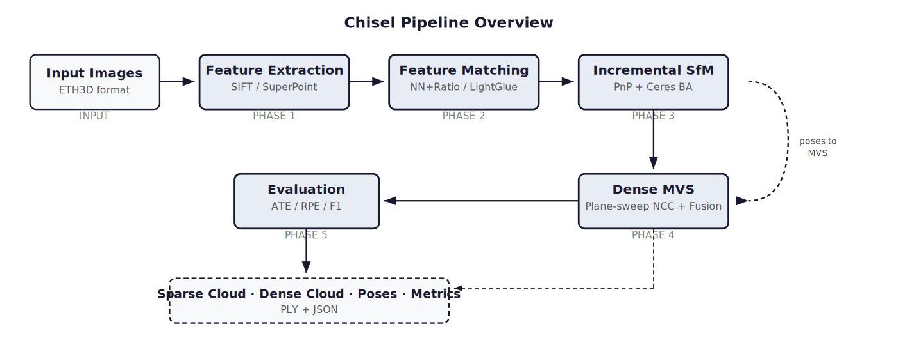
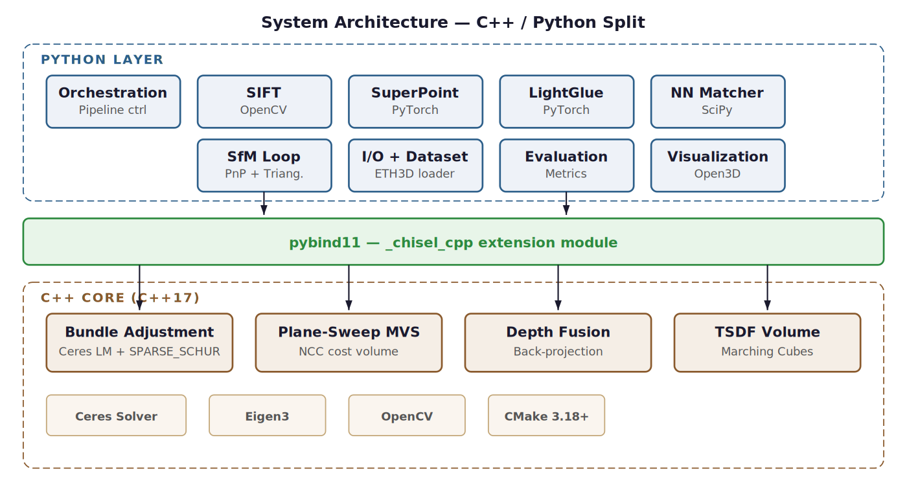
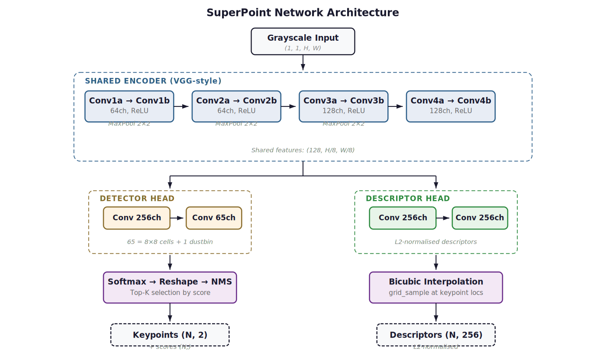
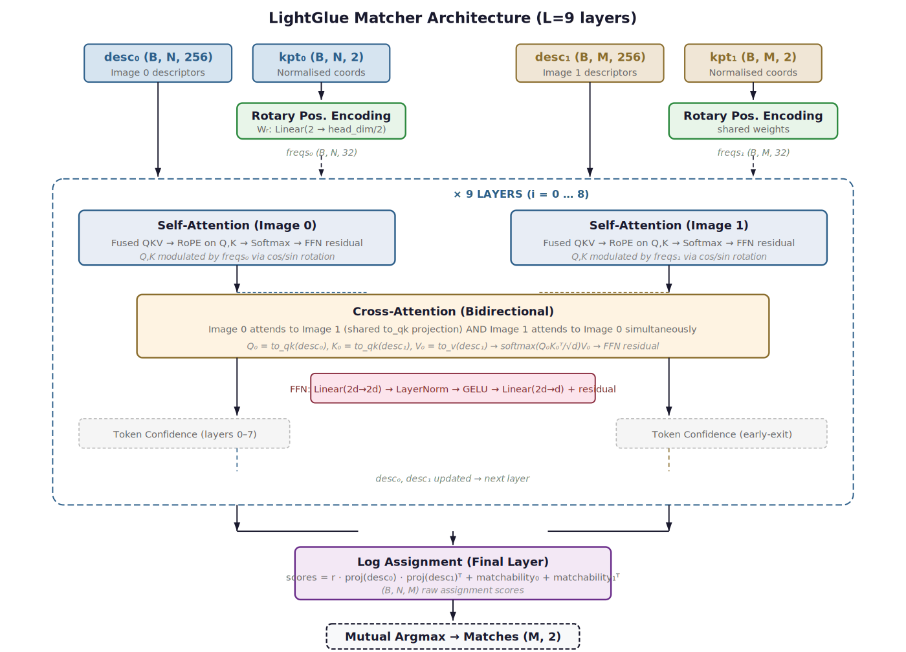
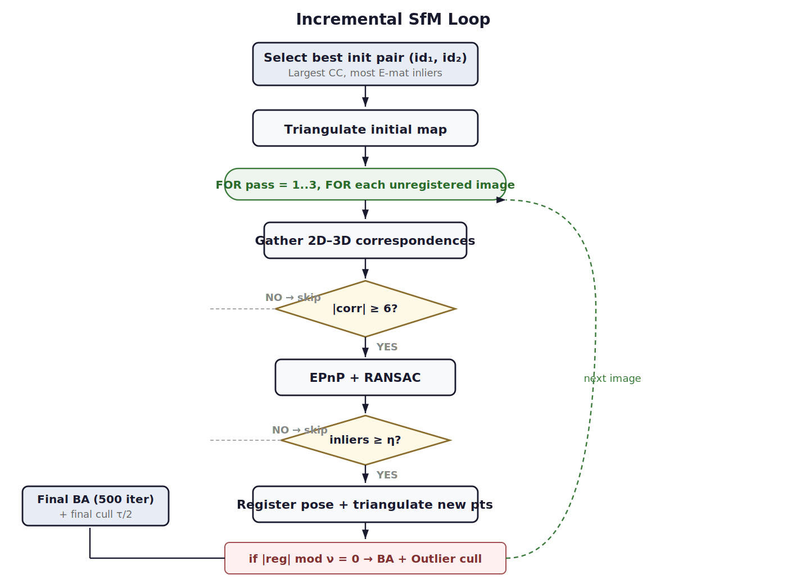
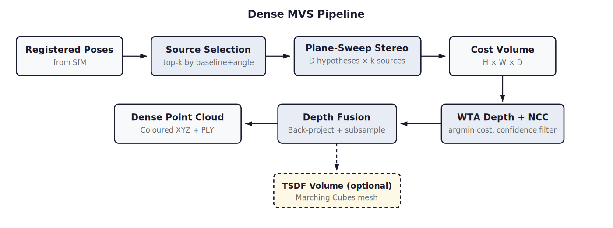

# Chisel — Multi-View 3D Reconstruction

End-to-end pipeline: feature extraction → matching → SfM → dense reconstruction, evaluated on [ETH3D](https://www.eth3d.net/).

<p align="center">
  
</p>

```
Perception (Python/PyTorch)  →  Geometry & Reconstruction (C++/Ceres/GTSAM)
         └──────────────── pybind11 bridge ─────────────────┘
```

---

## Technical Overview

Chisel is a modular multi-view 3D reconstruction system that combines classical and learned feature processing with a compiled C++ geometry backend. The pipeline has five sequential phases, each configurable independently:

**Phase 1 — Feature Extraction.** Keypoints and descriptors are extracted per image using either SIFT (OpenCV, 128-D descriptors) or SuperPoint (PyTorch, 256-D descriptors). Both produce a `FeatureData` object containing pixel coordinates, descriptor vectors, and detection scores. See [SuperPoint Architecture](#superpoint-architecture) below.

**Phase 2 — Feature Matching.** Putative correspondences are established between image pairs using either nearest-neighbour matching with Lowe's ratio test or a learned LightGlue attention matcher. Both strategies end with fundamental-matrix RANSAC to filter geometrically inconsistent matches. See [LightGlue Architecture](#lightglue-architecture) below.

**Phase 3 — Incremental SfM.** A two-view initialisation bootstraps the map from the best-connected image pair (essential matrix decomposition with cheirality check). Remaining images are registered incrementally via EPnP+RANSAC, interleaved with multi-view triangulation and Ceres-based bundle adjustment. BA minimises Huber-robust reprojection error with SPARSE_SCHUR factorisation; camera rotations are parameterised as unit quaternions with an EigenQuaternionManifold constraint. Post-BA outlier culling removes points with high mean reprojection error.

**Phase 4 — Dense MVS.** Depth maps are computed via plane-sweep stereo with NCC cost across D=128 inverse-depth hypotheses. Source views are selected by a baseline-angle heuristic. Valid depth pixels are back-projected to world coordinates and fused into a dense coloured point cloud. An optional TSDF volume with Marching Cubes mesh extraction is supported.

**Phase 5 — Evaluation.** Camera trajectories are aligned to ground truth via Umeyama Sim(3). Pose metrics (ATE RMSE, RPE) and point-cloud metrics (Accuracy, Completeness, F1 at τ ∈ {1, 2, 5, 10} cm) follow the ETH3D benchmark protocol.

---

## System Architecture

Geometry-intensive operations (bundle adjustment, dense stereo, depth fusion) are implemented in C++17 and exposed to Python via pybind11 as the `_chisel_cpp` extension module. The Python layer handles orchestration, I/O, feature extraction (PyTorch), and evaluation.

<p align="center">
  
</p>

| Component | Language | Dependencies |
|-----------|----------|-------------|
| Feature extraction | Python / PyTorch | OpenCV, PyTorch |
| Feature matching | Python / PyTorch | PyTorch, SciPy |
| Incremental SfM | Python + C++ BA | OpenCV, Ceres |
| Dense MVS | C++ | OpenCV, Eigen |
| Depth fusion / TSDF | C++ | OpenCV, Eigen |
| Evaluation | Python | SciPy, NumPy |
| Build system | CMake 3.18+ | pybind11, Ceres, GTSAM |

---

## SuperPoint Architecture

SuperPoint (DeTone et al., CVPR 2018) is a self-supervised convolutional network that jointly detects interest points and computes dense descriptors in a single forward pass. Chisel implements the full architecture natively in PyTorch and remaps MagicLeap pretrained weights at load time.

<p align="center">
  
</p>

**Shared Encoder.** A VGG-style backbone with four convolutional blocks (two 3×3 convolutions + ReLU + 2×2 max-pool each). Channel progression: 1 → 64 → 64 → 128 → 128. After four pooling stages the spatial resolution is reduced by 8×, producing a shared feature tensor of shape `(128, H/8, W/8)`.

**Detector Head.** Two convolutions (128 → 256 → 65) produce 65 channels: an 8×8 sub-pixel grid plus one dustbin channel. Channel-wise softmax converts logits to probabilities; the 64 non-dustbin channels are reshaped back to full resolution `(H, W)` by treating each 8×8 block as a sub-pixel grid. NMS (radius 4 px) and top-K selection produce the final keypoint set.

**Descriptor Head.** Two convolutions (128 → 256 → 256) followed by L2-normalisation produce a semi-dense descriptor map at 1/8 resolution. Descriptors at keypoint locations are obtained by bicubic interpolation via `grid_sample`.

---

## LightGlue Architecture

LightGlue (Lindenberger et al., ICCV 2023) is a Transformer-based learned matcher with L=9 alternating self-attention and cross-attention layers. It replaces the heuristic ratio test with a learned attention mechanism that jointly reasons about descriptor similarity and spatial layout.

<p align="center">
  
</p>

**Rotary Positional Encoding.** A learned linear projection `Wᵣ ∈ ℝ^(head_dim/2 × 2)` maps normalised 2D keypoint coordinates to frequency vectors. Coordinates are centred and scaled by `max(H, W)/2` to preserve aspect ratio (critical for pretrained weight compatibility). Frequencies modulate Q and K inside self-attention via cos/sin rotation on even/odd dimension pairs.

**Self-Attention (per-image).** Fused QKV projection (d_model → 3·d_model), split into 4 heads of dimension 64. RoPE applied to Q and K before scaled dot-product attention. Output passes through an FFN with residual: the FFN takes `cat([x, msg])` as input (2d → LayerNorm → GELU → d), gating how much attention signal to incorporate.

**Cross-Attention (bidirectional).** Image 0 attends to Image 1 and vice versa simultaneously using a shared `to_qk` projection. Both directions use pre-update features for symmetric information flow. RoPE is not used here because the two images have independent coordinate frames.

**Log Assignment + Match Extraction.** The final layer's assignment head produces `scores = r · proj(desc₀) · proj(desc₁)ᵀ + m₀ + m₁ᵀ` where `r` is a learned scalar and `m` are per-keypoint matchability logits. Mutual argmax on raw scores extracts matches; F-matrix RANSAC verification follows.

---

## Incremental SfM Loop

<p align="center">
  
</p>

---

## Dense MVS Pipeline

<p align="center">
  
</p>

---

## Requirements

| | |
|---|---|
| **Python** | 3.9+ |
| **C++** | C++17 compiler |
| **Build** | CMake 3.18+ |
| **C++ libs** | Eigen3, OpenCV, Ceres Solver, GTSAM, pybind11 |
| **Python libs** | PyTorch, OpenCV, NumPy, SciPy |

---

## Setup

### 1. Clone

```bash
git clone https://github.com/MisterEkole/chisel.git && cd chisel
```

### 2. System dependencies

**macOS**
```bash
brew install cmake eigen opencv ceres-solver gtsam pybind11
```

**Linux (Ubuntu/Debian)**
```bash
sudo apt install -y cmake build-essential python3-dev \
    libeigen3-dev libopencv-dev libceres-dev libgtsam-dev pybind11-dev
```

**Windows**
Install [CMake](https://cmake.org/download/) and [Visual Studio 2022](https://visualstudio.microsoft.com/) (Desktop C++ workload), then use [vcpkg](https://vcpkg.io/):
```powershell
git clone https://github.com/microsoft/vcpkg && cd vcpkg
.\bootstrap-vcpkg.bat
.\vcpkg install eigen3 opencv ceres gtsam pybind11
```

### 3. Python dependencies

```bash
pip install torch torchvision opencv-python numpy scipy pyyaml
```

### 4. Build

**macOS / Linux**
```bash
./build.sh            # C++ + Python package
./build.sh --test     # build + run tests
```

**Windows**
```powershell
mkdir build && cd build
cmake .. `
  -DCMAKE_TOOLCHAIN_FILE="<vcpkg-root>/scripts/buildsystems/vcpkg.cmake" `
  -DCMAKE_BUILD_TYPE=Release -DBUILD_PYTHON_BINDINGS=ON
cmake --build . --config Release
cd .. && pip install -e ".[dev]"
```

> **macOS CMake tip:** If packages aren't found, add `-DCMAKE_PREFIX_PATH="$(brew --prefix)"` to the cmake command.

### 5. Download weights

Required for `--extractor superpoint` or `--matcher lightglue`:

```bash
python scripts/download_weights.py
```

Weights are saved to `weights/`.

### 6. Download ETH3D data

```bash
python scripts/download_eth3d.py --output /data/eth3d --scenes courtyard delivery_area
```

---

## Run

```bash
# Default: SIFT + NN matcher
python scripts/run_pipeline.py --scene /data/eth3d/training/courtyard

# SuperPoint + LightGlue
python scripts/run_pipeline.py \
    --scene /data/eth3d/training/courtyard \
    --extractor superpoint \
    --matcher lightglue

# GTSAM pose graph instead of Ceres BA
python scripts/run_pipeline.py --scene /data/eth3d/training/courtyard --optimizer gtsam

# SfM only (skip dense)
python scripts/run_pipeline.py --scene /data/eth3d/training/courtyard --no-dense
```

**All CLI options**

| Flag | Default | Description |
|------|---------|-------------|
| `--scene` | — | Path to scene directory |
| `--dataset` + `--scene-name` | — | ETH3D root + scene name (alternative to `--scene`) |
| `--extractor` | `sift` | `sift` or `superpoint` |
| `--matcher` | `nn` | `nn` or `lightglue` |
| `--optimizer` | `ceres` | `ceres` or `gtsam` |
| `--weights-dir` | `weights/` | Directory with pretrained weights |
| `--max-dim` | `1600` | Max image dimension (px) |
| `--max-keypoints` | `4096` | Max keypoints per image |
| `--no-dense` | off | Skip dense reconstruction |
| `--output` | `./output` | Output directory |
| `--device` | `auto` | `auto`, `cpu`, or `cuda` |

---

## Evaluate

```bash
python scripts/run_eval.py --results ./output --dataset /data/eth3d
```

---

## Tests

```bash
./build.sh --test                                  # all tests
python -m pytest tests/python/ -v                  # Python only
./build/tests/cpp/test_geometry                    # C++ only (macOS/Linux)
.\build\tests\cpp\Release\test_geometry.exe        # C++ only (Windows)
```

---

## Project structure

```
chisel/
├── src/                        # C++ core
│   ├── core/                   # Types, I/O, mesh utils
│   ├── geometry/               # Epipolar, triangulation, PnP, BA, factor graph
│   ├── reconstruction/         # Dense stereo, TSDF fusion, meshing
│   └── bindings/               # pybind11 bridge
├── python/chisel/              # Python package
│   ├── perception/             # SuperPoint, SIFT, LightGlue, depth estimation
│   ├── data/                   # ETH3D dataset loader
│   ├── eval/                   # Accuracy / completeness / F1 metrics
│   └── pipeline.py             # Main orchestrator
├── docs/assets/                # Architecture diagrams
├── scripts/                    # CLI entry points
├── weights/                    # Pretrained weights (after download)
└── tests/                      # C++ (GTest) + Python (pytest) tests
```

---

## Optimizer choice: Ceres vs GTSAM

Both solve the same nonlinear optimization problems but at different levels of abstraction.

- **Ceres** (`--optimizer ceres`) — used for **full bundle adjustment**: jointly optimizes all camera poses and 3D points by minimizing reprojection error. Exploits the sparse block structure of BA via the Schur complement. Best accuracy.
- **GTSAM** (`--optimizer gtsam`) — used for **pose graph optimization**: only camera poses are optimized (3D points marginalized). Supports incremental updates via iSAM2. Better suited for large scenes or if you add loop-closure constraints later.

They are complementary. Use Ceres for maximum accuracy on small-to-medium scenes; GTSAM for scalability or SLAM-style workflows.

---

## License

MIT